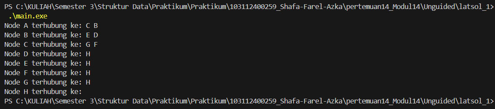
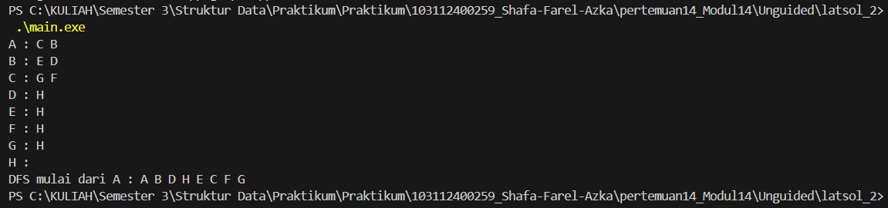

# <h1 align="center">Laporan Praktikum Modul 14 - Graph</h1>
<p align="center">Shafa Farel Azka - 103112400259</p>

## Dasar Teori
Definisi dari suatu graf adalah himpunan bendabenda yang disebut verteks (atau node) yang terhubung oleh sisi (atau edge atau arc). Biasanya graf digambarkan sebagai kumpulan titik-titik (melambangkan verteks) yang dihubungkan oleh garis-garis (melambangkan sisi).[1]

Graf merupakan struktur data yang terdiri dari kumpulan simpul (vertex) dan sisi (edge) yang menghubungkan antar simpul untuk merepresentasikan hubungan antar objek. Dalam implementasinya, graf dapat disimpan menggunakan struktur linked list untuk mempermudah pengelolaan hubungan dinamis antar elemen. Pada konteks pemodelan bangunan, graf mampu merepresentasikan komponen struktural seperti pondasi, rangka, dan atap sebagai simpul, sedangkan hubungan geometri maupun topologi antar komponen direpresentasikan melalui sisi. Dengan demikian, penggunaan graf memungkinkan penyimpanan data bangunan menjadi lebih terstruktur, terhubung, serta mendukung operasi penelusuran dan manipulasi data secara efisien pada aplikasi komputasi.[2]


## Guided 
##### graph_edge.cpp
```C++
#include "graph.h"

adrNode findNode(Graph G, infoGraph X) {
    adrNode P = G.first;
    while (P != NULL) {
        if (P->info == X) return P;
        else {
        P = P->next;
        }
    }
    return NULL;
}


void connectNode(Graph &G, infoGraph start, infoGraph end) {
    adrNode pStart = findNode(G, start);
    adrNode pEnd = findNode(G, end);
    if (pStart != NULL && pEnd != NULL) {
        adrEdge newEdge = new ElmEdge;
        newEdge-> node = pEnd;
        newEdge->next = pStart->firstEdge;
        pStart->firstEdge = newEdge;
 }
}
```
##### graph_init.cpp
```c++
#include "graph.h"

void createGraph(Graph &G) {
    G.first = NULL;
}

adrNode allocNode(infoGraph X) {          
    adrNode P = new ElmNode;             
    P->info = X;
    P->visited = false;
    P->firstEdge = NULL;
    P->next = NULL;
    return P;
}

void insertNode(Graph &G, infoGraph X) {
    adrNode P = allocNode(X);            
    if (G.first == NULL) {
        G.first = P;
    } else {
        adrNode Q = G.first;
        while (Q->next != NULL) {
            Q = Q->next;
        }
        Q->next = P;
    }
}
```
##### graph_print.cpp
```c++
#include "graph.h"

void printGraph(Graph G) {
    adrNode P = G.first;
    while (P != NULL) {
        cout << "Node" << P->info << "terhubung ke: ";
        adrEdge E = P -> firstEdge;
        while (E != NULL) {
            cout << E->node->info << " ";
            E = E->next;
        }
        cout << endl;
        P = P->next;
    }
    cout << endl;
}
```
##### graph.h
```c++
#ifndef GRAPH_H
#define GRAPH_H
#include <iostream>
using namespace std;


typedef char infoGraph;
typedef struct ElmNode *adrNode;
typedef struct ElmEdge *adrEdge;

struct ElmNode {
    infoGraph info;
    bool visited;
    adrEdge firstEdge;
    adrNode next;
};

struct ElmEdge {
   adrNode node;
   adrEdge next;
};

struct Graph{
    adrNode first;
};

void createGraph(Graph &G);
adrNode allocateNode(infoGraph x);
void insertNode(Graph &G, infoGraph x);
void connectNode(Graph &G, infoGraph start, infoGraph end);
void printGraph(Graph G);

#endif
```
##### main.cpp
```c++
#include <iostream>
#include "graph.h"
using namespace std;

int main(){
    Graph G;
    createGraph(G);

    //menambah node a, b, c, d
    insertNode(G, 'A');
    insertNode(G, 'B');
    insertNode(G, 'C');
    insertNode(G, 'D');

    //menghubungkan node
    connectNode(G, 'A', 'B');
    connectNode(G, 'A', 'C');
    connectNode(G, 'B', 'D');
    connectNode(G, 'C', 'D');

    cout << "Isi graph:" << endl;
    printGraph(G);

    return 0;
}
```
Program di atas merupakan satu kesatuan yang mengimplementasikan struktur graph berarah menggunakan linked list. Setiap node disimpan dalam linked list node, dan setiap node memiliki linked list edge yang menyimpan hubungan ke node lain. Fungsi insertNode menambahkan node baru, sedangkan connectNode membuat edge dengan mencari node asal dan tujuan, lalu menautkan pointer edge ke node tujuan. Program utama membuat graph kosong, menambah empat node (A, B, C, D), lalu menghubungkan antar node sesuai perintah, kemudian menampilkan isi graph menggunakan printGraph yang menelusuri tiap node dan edge yang terhubung.

## Unguided 

## graph.h
```c++
#ifndef GRAPH_H
#define GRAPH_H

#include <iostream>
#include <vector>
using namespace std;

typedef char infoGraph;
typedef struct ElmNode *adrNode;
typedef struct ElmEdge *adrEdge;

struct ElmEdge {
    adrNode node;
    adrEdge next;
};

struct ElmNode {
    infoGraph info;
    adrEdge firstEdge;
    adrNode next;
};

struct Graph {
    adrNode first;
};

void CreateGraph(Graph &G);
void InsertNode(Graph &G, infoGraph X);
adrNode FindNode(Graph G, infoGraph X);
void ConnectNode(Graph &G, adrNode N1, adrNode N2);
void PrintInfoGraph(Graph G);

void DFS(Graph G, adrNode P, bool visited[]);
void PrintDFS(Graph G, char start);

void PrintBFS(Graph G, char start);

#endif
```

## graph.cpp
```c++
#include "graph.h"
#include <algorithm>
#include <queue>
#include <vector>
#include <algorithm>

void CreateGraph(Graph &G){
    G.first = NULL;
}

void InsertNode(Graph &G, infoGraph X){
    adrNode P = new ElmNode;
    P->info = X;
    P->firstEdge = NULL;
    P->next = NULL;

    if(G.first == NULL){
        G.first = P;
    } else {
        adrNode Q = G.first;
        while(Q->next != NULL){
            Q = Q->next;
        }
        Q->next = P;
    }
}

adrNode FindNode(Graph G, infoGraph X){
    adrNode P = G.first;
    while(P != NULL){
        if(P->info == X){
            return P;
        }
        P = P->next;
    }
    return NULL;
}

void ConnectNode(Graph &G, adrNode N1, adrNode N2){
    adrEdge E = new ElmEdge;
    E->node = N2;
    E->next = N1->firstEdge;
    N1->firstEdge = E;
}

void PrintInfoGraph(Graph G){
    adrNode P = G.first;

    while(P != NULL){
        cout << P->info << " : ";
        adrEdge E = P->firstEdge;

        while(E != NULL){
            cout << E->node->info << " ";
            E = E->next;
        }

        cout << endl;
        P = P->next;
    }
}

#SOAL 2
void DFS(Graph G, adrNode P, bool visited[]){
    if(P == NULL) return;

    cout << P->info << " ";
    visited[P->info - 'A'] = true;

    vector<char> neighbours;
    adrEdge E = P->firstEdge;

    while(E != NULL){
        neighbours.push_back(E->node->info);
        E = E->next;
    }

    sort(neighbours.begin(), neighbours.end());

    for(char c : neighbours){
        adrNode next = FindNode(G, c);
        if(!visited[c - 'A']){
            DFS(G, next, visited);
        }
    }
}

void PrintDFS(Graph G, char start){
    adrNode P = FindNode(G, start);
    if(P == NULL){
        cout << "Node tidak ditemukan.\n";
        return;
    }

    bool visited[26] = {false};

    cout << "DFS mulai dari " << start << " : ";
    DFS(G, P, visited);
    cout << endl;
}

#SOAL 3
void PrintBFS(Graph G, char start){

    bool visited[26] = { false };

    adrNode P = G.first;

    // cari node awal
    while(P != nullptr && P->info != start){
        P = P->next;
    }

    if(P == nullptr){
        cout << "Node tidak ditemukan.\n";
        return;
    }

    queue<adrNode> Q;
    Q.push(P);
    visited[P->info - 'A'] = true;

    cout << "Hasil BFS mulai dari " << start << ": ";

    while(!Q.empty()){
        adrNode curr = Q.front();
        Q.pop();

        cout << curr->info << " ";

        vector<char> tetangga;

        adrEdge E = curr->firstEdge;
        while(E != nullptr){
            tetangga.push_back(E->node->info);
            E = E->next;
        }

        sort(tetangga.begin(), tetangga.end()); 

        for(char c : tetangga){
            adrNode next = FindNode(G, c);
            if(!visited[c - 'A']){
                visited[c - 'A'] = true;
                Q.push(next);
            }
        }
    }

    cout << endl;
}
```

## main.cpp
```C++
#include <iostream>
#include "graph.h"
using namespace std;

int main(){
    Graph G;
    CreateGraph(G);

    InsertNode(G, 'A');
    InsertNode(G, 'B');
    InsertNode(G, 'C');
    InsertNode(G, 'D');
    InsertNode(G, 'E');
    InsertNode(G, 'F');
    InsertNode(G, 'G');
    InsertNode(G, 'H');

    adrNode A = FindNode(G, 'A');
    adrNode B = FindNode(G, 'B');
    adrNode C = FindNode(G, 'C');
    adrNode D = FindNode(G, 'D');
    adrNode E = FindNode(G, 'E');
    adrNode F = FindNode(G, 'F');
    adrNode NodeG = FindNode(G, 'G');
    adrNode H = FindNode(G, 'H');

    ConnectNode(G, A, B);
    ConnectNode(G, A, C);
    ConnectNode(G, B, D);
    ConnectNode(G, B, E);
    ConnectNode(G, C, F);
    ConnectNode(G, C, NodeG);
    ConnectNode(G, D, H);
    ConnectNode(G, E, H);
    ConnectNode(G, F, H);
    ConnectNode(G, NodeG, H);

    PrintInfoGraph(G);
    
    #SOAL 2
    PrintDFS(G, 'A');
    
    #SOAL 3
    PrintBFS(G, 'A');

    return 0;
}
```
## Output
### a. Soal 1

Pada soal satu, dibuat sebuah program untuk merepresentasikan graf tidak berarah sesuai gambar yang diberikan menggunakan struktur node dan list. Program harus mampu menambahkan simpul dan sisi sehingga setiap hubungan antar node direpresentasikan dua arah karena graf tidak berarah.
### b. Soal 2

Pada soal kedua, program pada soal pertama dilengkapi dengan fitur penelusuran graf menggunakan algoritma Depth First Search (DFS). Penambahan ini dilakukan dengan membuat prosedur atau fungsi DFS yang menelusuri simpul mulai dari node awal dan memanfaatkan struktur rekursi agar program dapat bergerak ke simpul berikutnya sampai semua tetangga dikunjungi. Hasil penelusuran kemudian ditampilkan sesuai urutan kunjungan simpul. Dengan demikian, soal kedua berfokus pada implementasi dan output penelusuran DFS berdasarkan graf tidak berarah yang telah dibangun pada soal pertama.
### c. Soal 3

Pada soal ketiga, program dari soal sebelumnya kembali dikembangkan dengan menambahkan prosedur penelusuran Breadth First Search (BFS). BFS dilakukan dengan menggunakan struktur antrian (queue) untuk mengunjungi simpul secara bertahap dari tingkat terdekat ke tingkat berikutnya. Prosedur PrintBFS menerima parameter graf dan node awal, lalu menampilkan urutan simpul sesuai proses penelusuran BFS. Dengan demikian, soal ketiga melengkapi sistem graf tidak berarah dengan kemampuan menampilkan hasil penelusuran BFS setelah sebelumnya menampilkan DFS.
## Kesimpulan
Berdasarkan praktikum pada modul graf ini, dapat disimpulkan bahwa struktur data graf dapat direpresentasikan dengan menggunakan linked list untuk menyimpan node dan edge. Dari implementasi program, telah dilakukan penambahan node dan hubungan antar node sesuai graf tidak berarah yang diberikan. Program kemudian dikembangkan dengan menambahkan algoritma penelusuran Depth First Search (DFS) dan Breadth First Search (BFS) untuk menelusuri graf berdasarkan simpul awal. Melalui pengujian terhadap kedua algoritma, dapat dilihat perbedaan urutan penelusuran yang dihasilkan dimana DFS menelusuri simpul lebih dalam terlebih dahulu, sedangkan BFS menelusuri per tingkat secara berlapis. Dengan demikian, praktikum ini memberikan pemahaman pada implementasi graf dan pemanfaatan algoritma penelusuran dalam pemrograman.

## Referensi
**[1]** Anggara, F. D. (2009). Studi dan Implementasi Struktur Data Graf. _Jurnal Sekolah Teknik Elektro dan Informatika Institut Teknologi Bandung, Bandung_.[https://journal.uii.ac.id/Snati/article/view/553/477](https://informatika.stei.itb.ac.id/~rinaldi.munir/Matdis/2008-2009/Makalah2008/Makalah0809-097.pdf)
<br>[2] Hafiz, Alvin., Amanah, Fadilla., Damurti, Revi., & Harliana, Putri. (2025). _Implementasi Struktur Data Graf dalam Pemrograman C++ untuk Pemodelan Jaringan_. Ilmu Komputer, Universitas Negeri Medan, Jalan W. Iskandar Psr V, Medan Estate, Kabupaten Deli Serdang, Indonesia. Diakses pada 18 Desember 2025 melalui file:///D:/Unduhan%20Chrome/Khanif%20Yunan%20Pratama/11788-Article%20Text-48412-1-10-20241116.pdf
