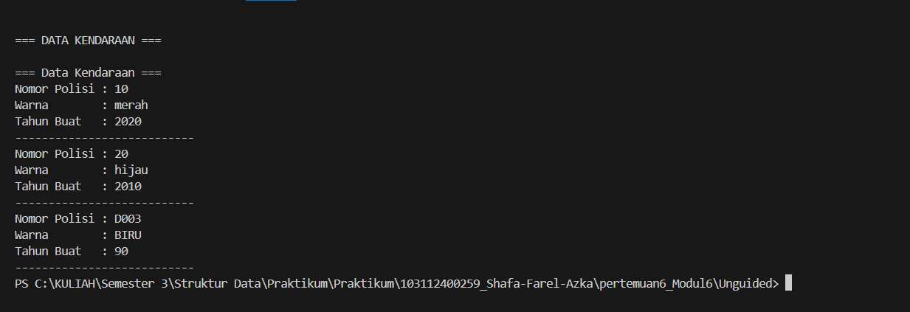
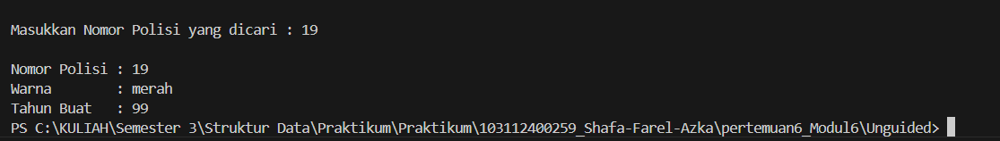
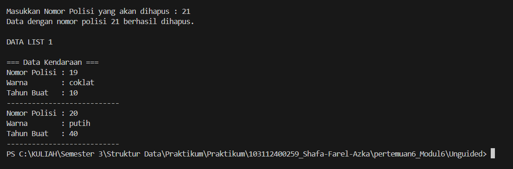

# <h1 align="center">Laporan Praktikum Modul 6 -Doubly Linked List (Bagian Pertama)</h1>
<p align="center">Shafa Farel Azka - 103112400259</p>

## Dasar Teori
Linked listadalahsuatu bentuk struktur data yang berupa sekumpulan elemen data yang bertipe sama dimana tiap elemen saling berkaitaataudihubungkan dengan elemen lain melalui suatu pointer. Pointer itu sendiri adalah alamat elemendata yang tersimpan di memori. Penggunaan pointer untuk mengacu elemen berakibat elemen-elemen bersebelahan secara logika walau tidak bersebelahan secara fisik di memori.[1].

Merupakan linked list dengan menggunakan pointer, dimana setiap node memiliki tiga buah field, yaitu: field pointer yang menunjuk ke pointer berikutnya, field pointer yang menunjuk ke pointer sebelumnya dan field yang berisi data dari node tersebut[1].Keunggulan DLL dibandingkan SLL terletak pada kemudahan dalam melakukan operasi penyisipan dan penghapusan data, karena DLL memungkinkan navigasi dua arah dalam daftar. penggunaan algoritma DLL untuk operasi insertion dan deletion. Algoritma insertion pada DLL dapat dilakukan di awal list (depan), di akhir list (belakang), atau di tengah list. Algoritma deletion pada DLL juga dapat dilakukan di awal list, di akhir list, atau di tengah list.[2]
## Guided 

### 1. Guided 1

##### listMakanan.cpp
```C++
#include "listMakanan.h"

#include <iostream>

using namespace std;

  

bool isEmpty(linkedlist List) {

    if(List.first == Nil){

        return true;

    } else {

        return false;

    }

}

  

void createList(linkedlist &List) {

    List.first = Nil;

    List.last = Nil;

}

  

address alokasi(string nama, string jenis, float harga, float rating) {

    address nodeBaru = new node;

    nodeBaru->isidata.nama = nama;

    nodeBaru->isidata.jenis = jenis;

    nodeBaru->isidata.harga = harga;

    nodeBaru->isidata.rating =  rating;

    nodeBaru->next = Nil;

    nodeBaru->prev = Nil;

    return nodeBaru;

}

  

void dealokasi(address &node) {

    node->next = Nil;

    node->prev = Nil;

    delete node;

}

  

void insertFirst(linkedlist &List, address nodeBaru){

    if (isEmpty(List)) {

        List.first = List.last = nodeBaru;

    } else {

        nodeBaru->next = List.first;

        List.first->prev = nodeBaru;

        List.first = nodeBaru;

    }

    cout << "Node " << nodeBaru->isidata.nama << " berhasil ditambahkan sebagai node pertama list" << endl;

}

  

void insertLast(linkedlist &List, address nodeBaru){

    if(isEmpty(List) == true){

        List.first = List.last = nodeBaru;

    } else {

        nodeBaru->prev = List.last;

        List.last->next = nodeBaru;

        List.last = nodeBaru;

    }

    cout << "Node " << nodeBaru->isidata.nama << " berhasil ditambahkan sebagai node terakhir list" << endl;

}

  

void insertAfter(linkedlist &List, address nodeBaru, address nodePrev){

    if(isEmpty(List) == true){

        List.first = List.last = nodeBaru;

    } else {

        if (nodePrev != Nil){

            if(nodePrev == List.last){

                insertLast(List, nodeBaru);

            } else {

                nodeBaru->next = nodePrev->next;

                nodeBaru->prev = nodePrev;

                (nodePrev->next)->prev = nodeBaru;

                nodePrev->next = nodeBaru;

                cout << "Node " << nodeBaru->isidata.nama << " berhasil ditambahkan setelah node " << nodePrev->isidata.nama << endl;

            }

        } else {

            cout << "node sebelumnya (nodePrev) tidak valid!" << endl;

        }

    }

}

  

void insertBefore(linkedlist &List, address nodeBaru, address nodeNext){

    if(isEmpty(List) == true){

        List.first = List.last = nodeBaru;

    } else {

        if (nodeNext != Nil){

            if(nodeNext == List.first){

                insertFirst(List, nodeBaru);

            } else {

                nodeBaru->next = nodeNext;

                nodeBaru->prev = nodeNext->prev;

                (nodeNext->prev)->next = nodeBaru;

                nodeNext->prev = nodeBaru;

                cout << "Node " << nodeBaru->isidata.nama << " berhasil ditambahkan sebelum node " << nodeNext->isidata.nama << endl;

            }

        } else {

            cout << "node setelahnya (nodeNext) tidak valid!" << endl;

        }

    }

}

  

void printList(linkedlist List) {

    if (isEmpty(List) == true) {

        cout << "List kosong!" << endl;

    } else {

        address nodeBantu = List.first;

        while (nodeBantu != Nil) {

            cout << "Nama makanan : " << nodeBantu->isidata.nama << endl;

            cout << "Jenis        : " << nodeBantu->isidata.jenis << endl;

            cout << "Harga        : " << nodeBantu->isidata.harga << endl;

            cout << "Rating       : " << nodeBantu->isidata.rating << endl;

            cout << "-------------------------------" << endl;

            nodeBantu = nodeBantu->next;

        }

    }

}

  

void updateFirst(linkedlist List){

    if(isEmpty(List) == true){

        cout << "List kosong!" << endl;

    } else {

        cout << "Masukkan update data node pertama : " << endl;

        cout << "Nama makanan : ";

        getline(cin, List.first->isidata.nama);

        cout << "Jenis makanan : ";

        getline(cin, List.first->isidata.jenis);

        cout << "Harga : ";

        cin >> List.first->isidata.harga;

        cout << "Rating : ";

        cin >> List.first->isidata.rating;

        cin.ignore(); //menghapus karakter newline (/n) dari input buffer

        cout << "Data Berhasil Diupdate!" << endl;

        cout << endl;

    }

}

  

void updateLast(linkedlist List){

    if(isEmpty(List) == true){

        cout << "List kosong!" << endl;

    } else {

        cout << "Masukkan update data node terakhir : " << endl;

        cout << "Nama makanan : ";

        getline(cin, List.last->isidata.nama);

        cout << "Jenis makanan : ";

        getline(cin, List.last->isidata.jenis);

        cout << "Harga : ";

        cin >> List.last->isidata.harga;

        cout << "Rating : ";

        cin >> List.last->isidata.rating;

        cin.ignore(); //menghapus karakter newline (/n) dari input buffer

        cout << "Data Berhasil Diupdate!" << endl;

        cout << endl;

    }

}

  

void updateAfter(linkedlist List, address nodePrev){

    if(isEmpty(List) == true){

        cout << "List kosong!" << endl;

    } else {

        if(nodePrev != Nil && nodePrev->next != Nil){

            address nodeBantu = nodePrev->next;

            cout << "masukkan update data node setelah node " << nodePrev->isidata.nama << " : " << endl;

            cout << "Nama makanan : ";

            getline(cin, nodeBantu->isidata.nama);

            cout << "Jenis makanan : ";

            getline(cin, nodeBantu->isidata.jenis);

            cout << "Harga : ";

            cin >> nodeBantu->isidata.harga;

            cout << "Rating : ";

            cin >> nodeBantu->isidata.rating;

            cin.ignore(); //menghapus karakter newline (/n) dari input buffer

            cout << "Data Berhasil Diupdate!" << endl;

            cout << endl;

        } else {

            cout << "Node sebelumnya (nodePrev) tidak valid!" << endl;

        }

    }

}

  

void updateBefore(linkedlist List, address nodeNext){

    if(isEmpty(List) == true){

        cout << "List kosong!" << endl;

    } else {

        if (nodeNext != Nil && nodeNext->prev != Nil){

            address nodeBantu = nodeNext->prev;

            cout << "masukkan update data node sebelum node " << nodeNext->isidata.nama << " : " << endl;

            cout << "Nama makanan : ";

            getline(cin, nodeBantu->isidata.nama);

            cout << "Jenis makanan : ";

            getline(cin, nodeBantu->isidata.jenis);

            cout << "Harga : ";

            cin >> nodeBantu->isidata.harga;

            cout << "Rating : ";

            cin >> nodeBantu->isidata.rating;

            cin.ignore(); //menghapus karakter newline (/n) dari input buffer

            cout << "Data Berhasil Diupdate!" << endl;

            cout << endl;

        } else {

            cout << "Node selanjutnya (nodeNext) tidak valid!" << endl;

        }

    }

}
```
##### listMakanan.h
```c++
#ifndef LISTMAKANAN_H

#define LISTMAKANAN_H

#define Nil NULL

  

#include<iostream>

using namespace std;

  

struct makanan{
    string nama;
    string jenis;
    float harga;
    float rating;
};

typedef makanan dataMakanan;
typedef struct node *address;

  

struct node{

    dataMakanan isidata;

    address next;

    address prev;

};

  

struct linkedlist{

    address first;

    address last;

};

  

bool isEmpty(linkedlist List);

void createList(linkedlist &List);

address alokasi(string nama, string jenis, float harga, float rating);

void dealokasi(address &node);

  

void insertFirst(linkedlist &List, address nodeBaru);

void insertLast(linkedlist &List, address nodeBaru);

void insertAfter(linkedlist &List, address nodeBaru, address Prev);

void insertBefore(linkedlist &List, address nodeBaru, address nodeNext);

  

void printList(linkedlist List);

  

void updateFirst(linkedlist List);

void updateLast(linkedlist List);

void updateAfter(linkedlist List, address prev);

void updateBefore(linkedlist List, address nodeNext);

  

#endif
```
##### main.cpp
```c++
#include "DoublyList.h"

using namespace std;
int main() {

    List L;
    CreateList(L);
    infotype dataKendaraan;
    address P;

    for (int i = 1; i <= 3; i++) {

        cout << "\nmasukkan nomor polisi: ";
        cin >> dataKendaraan.nopol;
	    if (isNopolExist(L, dataKendaraan.nopol)) {

        cout << "nomor polisi sudah terdaftar" << endl;

            i--;

            continue;

        }

  

        cout << "masukkan warna kendaraan: ";

        cin >> dataKendaraan.warna;

        cout << "masukkan tahun kendaraan: ";

        cin >> dataKendaraan.thnBuat;

  

        P = alokasi(dataKendaraan);

        insertLast(L, P);

    }

  

    cout << "\nDATA LIST 1" << endl;

    printInfo(L);

    infotype cari;

    cout << "\nMasukkan Nomor Polisi yang dicari : ";

    cin >> cari.nopol;

  

    address hasil = findElm(L, cari);

    if (hasil != Nil) {

        cout << "\nNomor Polisi : " << hasil->info.nopol << endl;

        cout << "Warna        : " << hasil->info.warna << endl;

        cout << "Tahun Buat   : " << hasil->info.thnBuat << endl;

    } else {

        cout << "\nData dengan nomor polisi tersebut tidak ditemukan." << endl;

    }

  

    string hapusNopol;

    cout << "\nMasukkan Nomor Polisi yang akan dihapus : ";

    cin >> hapusNopol;

  

    address hapus = L.First;

    address prec = Nil;

  

    while (hapus != Nil && hapus->info.nopol != hapusNopol) {

        prec = hapus;

        hapus = hapus->next;

    }

  

    if (hapus == Nil) {

        cout << "Data dengan nomor polisi " << hapusNopol << " tidak ditemukan." << endl;

    } else {

        if (hapus == L.First) {

            deleteFirst(L, hapus);

        } else if (hapus == L.Last) {

            deleteLast(L, hapus);

        } else {

            deleteAfter(prec, hapus);

        }

        dealokasi(hapus);

        cout << "Data dengan nomor polisi " << hapusNopol << " berhasil dihapus." << endl;

    }

  

    cout << "\nDATA LIST 1" << endl;

    printInfo(L);

  

    return 0;

}
```
Program ini mengimplementasikan struktur doubly linked list untuk mengelola data makanan, dengan isi seperti nama, jenis, harga, dan rating. Di dalam program, ada berbagai fungsi untuk mengelola list seperti insertFirst, insertLast, insertAfter, dan insertBefore untuk menambah node baru di posisi yang sesuai. Fungsi update (updateFirst, updateLast, updateBefore, updateAfter) memungkinkan pengguna untuk memperbarui informasi makanan pada node yang telah ada. Alur program dimulai dengan pembuatan list kosong, terus menambahkan beberapa data makanan menggunakan fungsi insert, diikuti memperbarui data makanan tertentu. Setelah itu, list yang telah dimodifikasi ditampilkan ke layar, memperlihatkan hasil perubahan yang dilakukan.

### 2. Guided 2

##### doublylist.h
```C++
#ifndef DOUBLYLIST_H
#define DOUBLYLIST_H
#include <iostream>
#include <string>
#define Nil NULL

using namespace std;

  

// Tipe data info (kendaraan)

struct kendaraan { //struktur untuk menyimpan info kendaraan

    string nopol;

    string warna;

    int thnBuat;

};

typedef kendaraan infotype;

  

// Tipe address dan elemen list

typedef struct ElmList *address;

struct ElmList {

    infotype info; // info kendaraan

    address next;

    address prev;

};

  

// Tipe list

struct List {

    address first; //pointer ke elemen pertama

    address last;  //pointer ke elemen terakhir

};

  

// Prototypes

void CreateList(List &L); //ngebuat list kosong

address alokasi(infotype x); //alokasi elemen baru/nambah elemen baru

void dealokasi(address &P); //dealokasi elemen/hapus elemen

  

// Insert Last

void insertLast(List &L, address P);

  

// Searching

address findElm(List L, string nopol);

  

// Delete

void deleteByNopol(List &L, string nopol);

  

// Tampilkan isi list

void printInfo(List L);

  

#endif 
```

##### doublylist.cpp
```c++
#include "Doublylist.h"

using namespace std;

  

void CreateList(List &L) { //blm ada elemen

    L.first = Nil;

    L.last = Nil;

}
address alokasi(infotype x) { //fs alokasi elemen baru
    address P = new ElmList; //alokasi memori untuk elemen baru
    P->info = x; //mengisi bagian info dengan data x
    P->next = Nil; //ini jadi nill karena gak terhubung ke list manapun
    P->prev = Nil;
    return P;

}

  

void dealokasi(address &P) {

    delete P; //menghapus elemen yang ditunjuk oleh P dan mengembalikan memori ke sistem

}

  

void insertLast(List &L, address P) {

    if (L.first == Nil) { // List kosong

        L.first = P; // elemen pertama dan terakhir sama dengan P

        L.last = P;

    } else { // List ada isi

        P->prev = L.last; // prev P menunjuk ke elemen terakhir saat ini

        (L.last)->next = P; // next elemen terakhir saat ini menunjuk ke P

        L.last = P; // update last menjadi P

    }

}

  

// Searching

address findElm(List L, string nopol) {

    address P = L.first; // mulai dari elemen pertama

    while (P != Nil) {

        //Bandingkan nopol yang dicari dengan nopol di elemen saat ini

        if (P->info.nopol == nopol) {

            return P; // Ketemu

        }

        P = P->next; // Lanjut ke elemen berikutnya kalau g cocok

    }

    return Nil; // Tidak ketemu

}

  

// Delete

void deleteByNopol(List &L, string nopol) {

    // Cari elemen dengan nopol yang sesuai

    address P = findElm(L, nopol);

    if (P == Nil) { // Tidak ditemukan

        cout << "Nomor polisi " << nopol << " tidak ditemukan.\n";

    } else { // Ditemukan

        if (P == L.first && P == L.last) { // Kasus 1: Hanya 1 elemen di list

            L.first = Nil; L.last = Nil;

        } else if (P == L.first) { // Kasus 2: Hapus elemen pertama tapi bukan satu-satunya

            L.first = P->next; // update first ke elemen berikutnya

            (L.first)->prev = Nil; // update prev elemen pertama barumenjadi nil

        } else if (P == L.last) { // Kasus 3: Hapus elemen terakhir

            L.last = P->prev; // update last ke elemen sebelumnya

            (L.last)->next = Nil; P->prev = Nil; // update next elemen terakhir baru menjadi nil

        } else { // Kasus 4: Hapus elemen di tengah

            address Prec = P->prev; // elemen sebelum P

            address Succ = P->next; // elemen setelah P

            Prec->next = Succ; Succ->prev = Prec; // hubungkan Prec ke Succ

            P->next = Nil; P->prev = Nil; // putuskan hubungan P dari list

        }

        dealokasi(P); // dealokasi elemen P

        cout << "Data dengan nomor polisi " << nopol << " berhasil dihapus.\n";

    }

}

  
  

void printInfo(List L) { //menampilkan isi list

    address P = L.first; //mulai dari elemen pertama

    if (P == Nil) {

        cout << "List Kosong.\n";

    } else {

        while (P != Nil) {

            cout << "no polisi: " << P->info.nopol << endl;

            cout << "warna    : " << P->info.warna << endl;

            cout << "tahun    : " << P->info.thnBuat << endl << endl;

            P = P->next;

        }

    }

}
```

##### main.cpp
```c++
#include "Doublylist.h"

  

using namespace std;

  

int main() { // penggunaan fungsi-fungsi dalam Doublylist

    List L; // deklarasi list

    CreateList(L); // buat list kosong

    address P; // deklarasi pointer elemen list

    infotype data; // deklarasi variabel info kendaraan

  

    data = {"D001", "hitam", 90}; P = alokasi(data); insertLast(L, P);

    data = {"D003", "putih", 70}; P = alokasi(data); insertLast(L, P);

    data = {"D004", "kuning", 90}; P = alokasi(data); insertLast(L, P);

  

    cout << "DATA LIST AWAL" << endl;

    printInfo(L);

  
  

    string cariNopol = "D001";

    cout << "MENCARI NOPOL " << cariNopol << " -" << endl;

    address found = findElm(L, cariNopol); //Manggil fungsi pencarian di Doublylist.cpp

    if (found != Nil) { // Ketemu

        cout << "Ditemukan: " << found->info.nopol << ", Warna: " << found->info.warna << endl << endl;

    } else {

        cout << cariNopol << " tidak ditemukan." << endl << endl;

    }

  

    string hapusNopol = "D003";

    cout << "MENGHAPUS NOPOL " << hapusNopol << " -" << endl;

    deleteByNopol(L, hapusNopol); //Manggil fungsi delete di Doublylist.cpp

    cout << endl;

  

    cout << "DATA LIST SETELAH HAPUS" << endl;

    printInfo(L);

  

    // Contoh delete elemen pertama

    cout << "MENGHAPUS ELEMEN PERTAMA " << endl;

    deleteByNopol(L, L.first->info.nopol); //Menghapus elemen pertama

    cout << endl;

    printInfo(L);

  
  

    return 0;

}
```
Program ini mengimplementasikan struktur data doubly linked list untuk mengelola data kendaraan, dengan informasi seperti nomor polisi (nopol), warna, dan tahun pembuatan kendaraan. Fungsi insertLast digunakan untuk menambah elemen baru di akhir list, sedangkan fungsi findElm digunakan untuk mencari kendaraan berdasarkan nomor polisi. Selain itu, terdapat juga fungsi deleteByNopol yang memungkinkan penghapusan elemen berdasarkan nomor polisi tertentu, dengan penanganan berbagai kasus, seperti penghapusan elemen pertama, terakhir, atau di tengah list. Program ini dimulai dengan membuat list kosong, kemudian menambahkan beberapa data kendaraan, mencari data kendaraan berdasarkan nomor polisi, menghapus data tertentu, dan menampilkan isi list sebelum dan sesudah penghapusan elemen.
## Unguided 

### 1. Soal 1

doublylist.cpp
```c++
#include "DoublyList.h"

using namespace std;

  

void CreateList(List &L) {

    L.First = Nil;

    L.Last = Nil;

}
address alokasi(infotype x) {
    address P = new ElmList;
    P->info = x;
    P->next = Nil;
    P->prev = Nil;
    return P;

}
void dealokasi(address &P) {
    delete P;
    P = Nil;
}

  

void insertLast(List &L, address P) {
    if (L.First == Nil) {
        L.First = P;
        L.Last = P;
    } else {
        L.Last->next = P;
        P->prev = L.Last;
        L.Last = P;
    }
}

  

void printInfo(List L) {

    if (L.First == Nil) {

        cout << "List kosong." << endl;

    } else {

        address P = L.First;

        while (P != Nil) {

            cout << "nomor polisi   : " << P->info.nopol << endl;

            cout << "warna          : " << P->info.warna << endl;

            cout << "tahun          : " << P->info.thnBuat << endl;

            P = P->next;

        }

    }

}

  

bool isNopolExist(List L, string nopol) {

    address P = L.First;

    while (P != Nil) {

        if (P->info.nopol == nopol) {

            return true;

        }

        P = P->next;

    }

    return false;

}

  

address findElm(List L, infotype x) {

    address P = L.First;

    while (P != Nil) {

        if (P->info.nopol == x.nopol) {

            return P;

        }

        P = P->next;

    }

    return Nil;

}

  

void deleteFirst(List &L, address &P) {

    if (L.First == Nil) {

        P = Nil;

    } else if (L.First == L.Last) {

        P = L.First;

        L.First = Nil;

        L.Last = Nil;

    } else {

        P = L.First;

        L.First = L.First->next;

        L.First->prev = Nil;

        P->next = Nil;

    }

}

  

void deleteLast(List &L, address &P) {

    if (L.First == Nil) {

        P = Nil;

    } else if (L.First == L.Last) {

        P = L.Last;

        L.First = Nil;

        L.Last = Nil;

    } else {

        P = L.Last;

        L.Last = L.Last->prev;

        L.Last->next = Nil;

        P->prev = Nil;

    }

}

  

void deleteAfter(address Prec, address &P) {

    if (Prec == Nil || Prec->next == Nil) {

        P = Nil;

    } else {

        P = Prec->next;

        Prec->next = P->next;

        if (P->next != Nil) {

            P->next->prev = Prec;

        }

        P->next = Nil;

        P->prev = Nil;

    }

}
```

doublylist.h
```c++
#ifndef DOUBLYLIST_H
#define DOUBLYLIST_H
#include <iostream>
#include <string>
#define Nil NULL

using namespace std;
struct kendaraan {
    string nopol;
    string warna;
    int thnBuat;
};
typedef kendaraan infotype;
typedef struct ElmList *address;
struct ElmList {
    infotype info;
    address next;
    address prev;

};
struct List {

    address First;

    address Last;

};

  

void CreateList(List &L);
address alokasi(infotype x);
void dealokasi(address &P);
void insertLast(List &L, address P);
void printInfo(List L);
bool isNopolExist(List L, string nopol);

address findElm(List L, infotype x);

void deleteFirst(List &L, address &P);

void deleteLast(List &L, address &P);

void deleteAfter(address Prec, address &P);

  

#endif
```

main.cpp
```C++
#include "DoublyList.h"

using namespace std;
int main() {
    List L;
    CreateList(L);
    infotype dataKendaraan;
    address P;

  

    for (int i = 1; i <= 3; i++) {

        cout << "\nmasukkan nomor polisi: ";

        cin >> dataKendaraan.nopol;

  

        if (isNopolExist(L, dataKendaraan.nopol)) {

            cout << "nomor polisi sudah terdaftar" << endl;

            i--;

            continue;

        }

  

        cout << "masukkan warna kendaraan: ";

        cin >> dataKendaraan.warna;

        cout << "masukkan tahun kendaraan: ";

        cin >> dataKendaraan.thnBuat;

  

        P = alokasi(dataKendaraan);

        insertLast(L, P);

    }

  

    cout << "\nDATA LIST 1" << endl;

    printInfo(L);

    infotype cari;

    cout << "\nMasukkan Nomor Polisi yang dicari : ";

    cin >> cari.nopol;

  

    address hasil = findElm(L, cari);

    if (hasil != Nil) {

        cout << "\nNomor Polisi : " << hasil->info.nopol << endl;

        cout << "Warna        : " << hasil->info.warna << endl;

        cout << "Tahun Buat   : " << hasil->info.thnBuat << endl;

    } else {

        cout << "\nData dengan nomor polisi tersebut tidak ditemukan." << endl;

    }

  

    string hapusNopol;

    cout << "\nMasukkan Nomor Polisi yang akan dihapus : ";

    cin >> hapusNopol;

  

    address hapus = L.First;

    address prec = Nil;

  

    while (hapus != Nil && hapus->info.nopol != hapusNopol) {

        prec = hapus;

        hapus = hapus->next;

    }

  

    if (hapus == Nil) {

        cout << "Data dengan nomor polisi " << hapusNopol << " tidak ditemukan." << endl;

    } else {

        if (hapus == L.First) {

            deleteFirst(L, hapus);

        } else if (hapus == L.Last) {

            deleteLast(L, hapus);

        } else {

            deleteAfter(prec, hapus);

        }

        dealokasi(hapus);

        cout << "Data dengan nomor polisi " << hapusNopol << " berhasil dihapus." << endl;

    }

  

    cout << "\nDATA LIST 1" << endl;

    printInfo(L);

  

    return 0;

}
```
### Output Soal 1 :

Program ini merupakan implementasi dari struktur data Doubly Linked List yang digunakan untuk menyimpan data kendaraan, seperti nomor polisi, warna, dan tahun pembuatan. Program dibagi menjadi tiga file yaitu DoublyList.h untuk mendefinisikan struktur data, DoublyList.cpp untuk mengisi logika fungsi seperti membuat list, menambah data, dan menampilkan isi list, serta main.cpp untuk menjalankan proses input dan output. Pengguna dapat memasukkan maksimal tiga data kendaraan, dan sistem akan menolak jika ada nomor polisi yang sama sudah terdaftar. Setelah semua data dimasukkan, program menampilkan seluruh daftar kendaraan yang sudah tersimpan di dalam list.

### 2. Perintah 2
Untuk bisa mencari, menambahkan beberapa perintah yaitu:

Pada doublylist.h
```C++
address findElm(List L, infotype x);
```

Pada doublylist.cpp
```C++
address findElm(List L, infotype x) {
    address P = L.First;
    while (P != Nil) {
        if (P->info.nopol == x.nopol) {
            return P;
        }
        P = P->next;
    }
    return Nil; 
}
```

Pada main.cpp
```C++
    string cari;

    cout << "\nMasukkan Nomor Polisi yang dicari : ";

    cin >> cari;

  

    address hasil = findElm(L, cari);

    cout << endl;

  

    if (hasil != Nil) {

        cout << "Nomor Polisi : " << hasil->info.nopol << endl;

        cout << "Warna        : " << hasil->info.warna << endl;

        cout << "Tahun Buat   : " << hasil->info.thnBuat << endl;

    } else {

        cout << "Data tidak ditemukan!" << endl;

    }

  

    return 0;

}
```


### Output Perintah 2 :


### 3. Perintah 3
Untuk bisa menghapus, menambahkan beberapa perintah yaitu:

pada doublylist.h
```C++
void deleteFirst(List &L, address &P);
void deleteLast(List &L, address &P);
void deleteAfter(address Prec, address &P);
```

pada doublylist.cpp
```C++
void deleteFirst(List &L, address &P) {
    if (L.First == Nil) {
        P = Nil;
    } else if (L.First == L.Last) {
        P = L.First;
        L.First = Nil;
        L.Last = Nil;
    } else {
        P = L.First;
        L.First = L.First->next;
        L.First->prev = Nil;
        P->next = Nil;
    }
}

void deleteLast(List &L, address &P) {
    if (L.First == Nil) {
        P = Nil;
    } else if (L.First == L.Last) {
        P = L.Last;
        L.First = Nil;
        L.Last = Nil;
    } else {
        P = L.Last;
        L.Last = L.Last->prev;
        L.Last->next = Nil;
        P->prev = Nil;
    }
}

void deleteAfter(address Prec, address &P) {
    if (Prec == Nil || Prec->next == Nil) {
        P = Nil;
    } else {
        P = Prec->next;
        Prec->next = P->next;
        if (P->next != Nil) {
            P->next->prev = Prec;
        }
        P->next = Nil;
        P->prev = Nil;
    }
}
```

pada main.cpp
```C++
    string hapusNopol;
    cout << "\nMasukkan Nomor Polisi yang akan dihapus : ";
    cin >> hapusNopol;

    address hapus = L.First;
    address prec = Nil;

    while (hapus != Nil && hapus->info.nopol != hapusNopol) {
        prec = hapus;
        hapus = hapus->next;
    }

    if (hapus == Nil) {
        cout << "Data dengan nomor polisi " << hapusNopol << " tidak ditemukan." << endl;
    } else {
        if (hapus == L.First) {
            deleteFirst(L, hapus);
        } else if (hapus == L.Last) {
            deleteLast(L, hapus);
        } else {
            deleteAfter(prec, hapus);
        }
        dealokasi(hapus);
        cout << "Data dengan nomor polisi " << hapusNopol << " berhasil dihapus." << endl;
    }

    cout << "\nDATA LIST 1" << endl;
    printInfo(L);
```
### Output Unguided 3 :

Menambahkan bagian kode diatas supaya program bisa menghapus data kendaraan berdasarkan nomor polisi tertentu. Karena posisi data yang akan dihapus bisa berada di awal, tengah, atau akhir list, maka dibuat tiga prosedur yaitu deleteFirst, deleteLast, dan deleteAfter. Ketiganya berfungsi menjaga agar hubungan antar node tetap rapi setelah penghapusan dilakukan. Sedangkan bagian tambahan di main.cpp dipakai untuk meminta input nomor polisi yang ingin dihapus, mencari posisinya di list, lalu memanggil prosedur yang sesuai agar data tersebut bisa dihapus dengan aman dan list tetap tersusun dengan benar.
## Kesimpulan
Kesimpulannya, doubly linked list adalah struktur data yang memungkinkan setiap elemen terhubung dua arah, yaitu ke elemen sebelumnya dan berikutnya. Pasti hal ini memudahkan proses manipulasi data seperti penambahan, pencarian, maupun penghapusan elemen tanpa harus menggeser seluruh data. 
## Referensi
[1] Sihombing, Johnson. "Penerapan stack dan queue pada array dan linked list dalam java." _INFOKOM (Informatika & Komputer)_ 7.2 (2019): 15-24. https://journal.piksi.ac.id/index.php/INFOKOM/article/view/160
<br>[2] Wijoyo, A., Prayudi, L. A., Fiqih, M., Santoso, R. D., Putra, R. T. S., Arifin, T., & Farhan, A. (2024). _Penggunaan Algoritma Doubly Linked List Untuk Insertion Dan Deletion_. JRIIN : Jurnal Riset Informatika Dan Inovasi, 1(12), 1329–1331. https://jurnalmahasiswa.com/index.php/jriin/article/view/1282?utm_source=chatgpt.com
