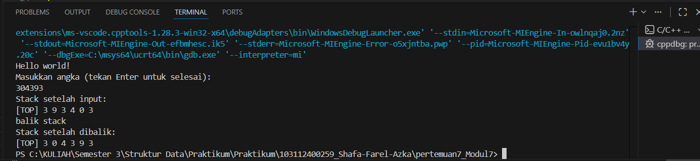

# <h1 align="center">Laporan Praktikum Modul 7 -Stack</h1>
<p align="center">Shafa Farel Azka - 103112400259</p>

## Dasar Teori
Stack merupakan struktur data yang bertumpuk dengan konsep urutan yang disebut dengan LIFO (Last In First Out). Konsep LIFO tersebut memiliki beberapa proses.[1] Stack sering digunakan dalam aplikasi yang memerlukan urutan pengolahan data yang terbalik, seperti dalam operasi undo pada editor teks atau dalam pemrograman rekursif. Setiap elemen dalam stack disimpan dalam node yang saling terhubung, dengan elemen teratas yang menjadi titik akses pertama. Operasi utama pada stack meliputi _push_ (menambahkan elemen ke dalam stack), _pop_ (mengambil elemen teratas), dan _peek_ (melihat elemen teratas tanpa menghapusnya)[2]. Selain itu, stack juga dapat diimplementasikan menggunakan array atau linked list, tergantung pada kebutuhan memori dan efisiensi yang diinginkan[2].

Pada implementasi stack menggunakan array, ukuran stack terbatas oleh kapasitas array, sehingga tidak fleksibel dalam hal penambahan elemen setelah kapasitas maksimum tercapai[2]. Sementara itu, penggunaan linked list untuk stack memberikan fleksibilitas lebih besar, karena elemen dapat ditambahkan secara dinamis tanpa batasan kapasitas, dengan hanya memperhatikan pointer yang mengarah ke elemen sebelumnya[2].

Stack juga memiliki banyak kegunaan dalam berbagai algoritma dan aplikasi, seperti dalam perhitungan ekspresi matematika, pengelolaan memori pada program komputer, dan traversal struktur data lainnya. Dalam konteks stack berbasis array, operasi _push_ dan _pop_ dapat dilakukan dalam waktu konstan (O(1)), yang membuatnya sangat efisien untuk aplikasi yang membutuhkan penambahan atau pengambilan elemen secara cepat dan terurut[1].

## Guided 

### 1. Guided 1
##### stack.cpp
```C++
#include "stack.h"
#include <iostream>

using namespace std;

bool isEmpty(stack listStack){
    if(listStack.top == Nil){
        return true;
    } else {
        return false;
    }
}

void createStack(stack &listStack){
    listStack.top = Nil;
}

address alokasi(int angka){
    address nodeBaru = new node;
    nodeBaru->dataAngka = angka;
    nodeBaru->next = Nil;
    return nodeBaru;
}

void dealokasi(address &node){
    node->next = Nil;
    delete node;
}

void push(stack &listStack, address nodeBaru){
    nodeBaru->next = listStack.top;
    listStack.top = nodeBaru;
    cout << "Node " << nodeBaru->dataAngka << " berhasil ditambahkan kedalam stack!" << endl;
}

void pop(stack &listStack){
    address nodeHapus;
    if(isEmpty(listStack) == true){
        cout << "Stack kosong!" << endl;
    } else {
        nodeHapus = listStack.top;
        int data = nodeHapus->dataAngka;
        listStack.top = listStack.top->next;
        nodeHapus->next = Nil;
        dealokasi(nodeHapus);
        cout << "node " <<  data << " berhasil dihapus dari stack!" << endl;
    }
}

void update(stack &listStack, int posisi){
    if(isEmpty(listStack) == true){
        cout << "Stack kosong!" << endl;
    } else {
        if(posisi <= 0){
            cout << "Posisi tidak valid!" << endl;
        } else {
            address nodeBantu = listStack.top;
            int count = 1;
            bool found = false;
            while(nodeBantu != Nil){
                if(count < posisi){
                    nodeBantu = nodeBantu->next;
                    count++;
                } else if(count == posisi){
                    cout << "Update node poisisi ke-" << posisi << endl;
                    cout << "Masukkan angka : ";
                    cin >> nodeBantu->dataAngka;
                    cout << "Data berhasil diupdate!" << endl;
                    cout << endl;
                    found = true;
                    break;
                }
            }
            if(found == false){
                cout << "Posisi " << posisi << " tidak valid!" << endl;
            }
        }
    }
}

void view(stack listStack){ //mencetak dari tumpukan paling atas ke tumpukan paling bawah
    if(isEmpty(listStack) == true){
        cout << "List kosong!" << endl;
    } else {
        address nodeBantu = listStack.top;
        while(nodeBantu != Nil){
            cout << nodeBantu->dataAngka << " ";
            nodeBantu = nodeBantu->next;
        }
    }
    cout << endl;
}

void searchData(stack listStack, int data){
    if(isEmpty(listStack) == true){
        cout << "List kosong!" << endl;
    } else {
        address nodeBantu = listStack.top;
        int posisi = 1;
        bool found = false;
        cout << "Mencari data " << data << "..." << endl;
        while(nodeBantu != Nil){
            if(nodeBantu->dataAngka == data){
                cout << "Data " << data << " ditemukan pada posisi ke-" << posisi << endl;
                found = true;
                cout << endl;
                break;
            } else {
                posisi++;
                nodeBantu = nodeBantu->next;
            }
        }
        if(found == false){
            cout << "Data " << data << " tidak ditemukan didalam stack!" << endl;
            cout << endl;
        }
    }
}
```
##### stack.h
```c++
#ifndef STACK_H
#define STACK_H
#define Nil NULL

#include<iostream>
using namespace std;

typedef struct node *address;

struct node{
    int dataAngka;
    address next;
};

struct stack{
    address top;
};

bool isEmpty(stack listStack);
void createStack(stack &listStack);
address alokasi(int angka);
void dealokasi(address &node);
void push(stack &listStack, address nodeBaru);
void pop(stack &listStack);
void update(stack &listStack, int posisi);
void view(stack listStack);
void searchData(stack listStack, int data);

#endif
```
##### main.cpp
```c++
#include "stack.h"
#include <iostream>

using namespace std;

int main(){
    stack listStack;
    address nodeA, nodeB, nodeC, nodeD, nodeE = Nil;
    createStack(listStack);

    nodeA = alokasi(1);
    nodeB = alokasi(2);
    nodeC = alokasi(3);
    nodeD = alokasi(4);
    nodeE = alokasi(5);

    push(listStack, nodeA);
    push(listStack, nodeB);
    push(listStack, nodeC);
    push(listStack, nodeD);
    push(listStack, nodeE);
    cout << endl;

    cout << "--- Stack setelah push ---" << endl;
    view(listStack);
    cout << endl;

    pop(listStack);
    pop(listStack);
    cout << endl;

    cout << "--- Stack setelah pop 2 kali ---" << endl;
    view(listStack);
    cout << endl;

    update(listStack, 2);
    update(listStack, 1);
    update(listStack, 4);
    cout << endl;

    cout << "--- Stack setelah update ---" << endl;
    view(listStack);
    cout << endl;

    searchData(listStack, 4);
    searchData(listStack, 9);

    return 0;
}
```
Program di atas adalah implementasi struktur data stack menggunakan linked list. Program ini mendefinisikan struktur stack yang berisi pointer top yang menunjuk ke elemen paling atas stack. Fungsi-fungsinya meliputi: push untuk menambahkan elemen ke stack, pop untuk menghapus elemen teratas, update untuk mengubah data pada posisi tertentu, view untuk menampilkan seluruh elemen stack, dan searchData untuk mencari data dalam stack. Program ini juga menangani kondisi stack kosong dan pengecekan validitas posisi saat memperbarui data.

### 2. Guided 2
##### stack.cpp
```C++
#include "stack.h"
using namespace std;
// Fungsi untuk membuat stack baru dengan menginisialisasi top = Nil
void CreateStack(Stack &S) {
    S.top = Nil;  // Inisialisasi top dengan nilai Nil mendakan stack kosong
}

// Fungsi untuk mengecek apakah stack kosong
bool isEmpty(Stack S) {
    return S.top == Nil;  // Mengembalikan true jika top bernilai Nil, false jika tidak
}

// Fungsi untuk mengecek apakah stack penuh
bool isFull(Stack S) {
    return S.top == MaxEl - 1;  // Mengembalikan true jika top mencapai batas maksimum (MaxEl-1)
}

// Fungsi untuk menambah elemen ke dalam stack (push)
void push(Stack &S, infotype x) {
    if (!isFull(S)) {  // Cek apakah stack belum penuh
        S.top++;  // Increment nilai top
        S.info[S.top] = x;  // Masukkan nilai x ke array info pada indeks top
    } else {
        cout << "Stack Penuh!" << endl;  // Tampilkan pesan jika stack penuh
    }
}

// Fungsi untuk mengambil elemen teratas dari stack (pop)
infotype pop(Stack &S) {
    infotype x = -999;  // Inisialisasi nilai default jika stack kosong
    if (!isEmpty(S)) {  // Cek apakah stack tidak kosong
        x = S.info[S.top];  // Ambil nilai teratas
        S.top--;  // Decrement nilai top
    } else {
        cout << "Stack Kosong!" << endl;  // Tampilkan pesan jika stack kosong
    }
    return x;  // Kembalikan nilai yang diambil
}

// Fungsi untuk menampilkan isi stack
void printInfo(Stack S) {
    if (isEmpty(S)) {  // Cek apakah stack kosong
        cout << "Stack Kosong" << endl;  // Tampilkan pesan jika kosong
    } else {
        cout << "[TOP] ";  // Tampilkan penanda posisi top
        for (int i = S.top; i >= 0; i--) {  // Loop dari top sampai dasar stack
            cout << S.info[i] << " ";  // Tampilkan setiap elemen
        }
        cout << endl;  // Pindah baris setelah selesai
    }
}

// Fungsi untuk membalik urutan elemen dalam stack
void balikStack(Stack &S) {
    if (!isEmpty(S)) {  // Cek apakah stack tidak kosong
        Stack temp1, temp2;  // Deklarasi dua stack temporary
        CreateStack(temp1); CreateStack(temp2);  // Inisialisasi kedua stack temporary

        while (!isEmpty(S)) { push(temp1, pop(S)); }  // Pindahkan semua elemen ke temp1 (urutan terbalik)

        while (!isEmpty(temp1)) { push(temp2, pop(temp1)); }  // Pindahkan ke temp2 (urutan terbalik lagi)

        while (!isEmpty(temp2)) { push(S, pop(temp2)); }  // Kembalikan ke stack asal (urutan sudah benar)
    }
}
```

##### stack.h
```c++
#ifndef STACK_H

#define MaxEl 20
#define Nil -1

#include <iostream>
using namespace std;

typedef int infotype;
struct Stack{
    infotype info[MaxEl];
    int top;
};

void CreateStack(Stack &S);
bool isEmpty(Stack S);
bool isFull(Stack S);
void push(Stack &S, infotype X);
infotype pop(Stack &S);
void printInfo(Stack S);
void balikStack(Stack &S);

#endif
```

##### main.cpp
```c++
#include "stack.h"
#include <iostream>

using namespace std;

int main() {
    Stack S;
    CreateStack(S);

    push(S, 3);
    push(S, 4);
    push(S, 8);
    pop(S);
    push(S, 2);
    push(S, 3);
    pop(S);
    push(S, 9);

    cout << "Stack Awal:" << endl;
    printInfo(S);

    cout << "balik stack" << endl;
    balikStack(S);

    cout << "Stack Setelah dibalik:" << endl;
    printInfo(S);

    return 0;
}
```
Program di atas mengimplementasikan struktur data stack menggunakan array statis. Stack ini memiliki batasan jumlah elemen yang dapat ditampung (MaxEl) dan elemen-elemen stack disimpan dalam array info. Fungsi utama yang disediakan antara lain push untuk menambahkan elemen ke dalam stack, pop untuk mengambil elemen teratas, serta printInfo untuk menampilkan seluruh isi stack. Selain itu, ada fungsi balikStack yang membalikkan urutan elemen stack menggunakan dua stack sementara. Fungsi CreateStack digunakan untuk menginisialisasi stack dengan top yang menunjukkan indeks elemen teratas, sementara fungsi isEmpty dan isFull mengecek apakah stack kosong atau penuh.
## Unguided 

stack.h
```c++
#ifndef STACK_H
#define STACK_H

#define MaxEl 20
#define Nil -1

#include <iostream>
using namespace std;

typedef int infotype;

struct Stack {
    infotype info[MaxEl];
    int top;
};

void CreateStack(Stack &S);
bool isEmpty(Stack S);
bool isFull(Stack S);
void push(Stack &S, infotype X);
infotype pop(Stack &S);
void printInfo(Stack S);
void balikStack(Stack &S);
void getInputStream(Stack &S);

#endif
```

stack.cpp
```c++
#include "stack.h"
using namespace std;

void CreateStack(Stack &S) {
    S.top = Nil;
}

bool isEmpty(Stack S) {
    return S.top == Nil;
}

bool isFull(Stack S) {
    return S.top == MaxEl - 1;
}

void push(Stack &S, infotype x) {
    if (isFull(S)) {
        cout << "Stack Penuh!" << endl;
    } else {
        S.top++;
        S.info[S.top] = x;
    }
}

infotype pop(Stack &S) {
    infotype x = -999;
    if (isEmpty(S)) {
        cout << "Stack Kosong!" << endl;
    } else {
        x = S.info[S.top];
        S.top--;
    }
    return x;
}

void printInfo(Stack S) {
    if (isEmpty(S)) {
        cout << "Stack Kosong!" << endl;
    } else {
        cout << "[TOP] ";
        for (int i = S.top; i >= 0; i--) {
            cout << S.info[i] << " ";
        }
        cout << endl;
    }
}

void balikStack(Stack &S) {
    if (!isEmpty(S)) {
        Stack temp1, temp2;
        CreateStack(temp1); CreateStack(temp2);

        while (!isEmpty(S)) { push(temp1, pop(S)); }
        while (!isEmpty(temp1)) { push(temp2, pop(temp1)); }
        while (!isEmpty(temp2)) { push(S, pop(temp2)); }
    }
}

void getInputStream(Stack &S) {
    char input;
    cout << "Masukkan angka (tekan Enter untuk selesai):" << endl;
    while (true) {
        input = cin.get();
        if (input == '\n') {
            break;
        }
        push(S, input - '0');
    }
}

```

main.cpp
```C++
#include "stack.h"
#include <iostream>

using namespace std;

int main() {
    cout << "Hello world!" << endl;

    Stack S;
    CreateStack(S);

    getInputStream(S);

    cout << "Stack setelah input:" << endl;
    printInfo(S);

    cout << "balik stack" << endl;
    balikStack(S);

    cout << "Stack setelah dibalik:" << endl;
    printInfo(S);

    return 0;
}

```
### Output:

Program ini mengimplementasikan struktur data stack menggunakan array dengan berbagai prosedur, termasuk push, pop, printInfo, dan balikStack. Selain itu, dua prosedur baru ditambahkan: pushAscending, yang menyisipkan elemen ke dalam stack dengan urutan menaik (ascending), dan getInputStream, yang terus membaca input karakter dari pengguna dan memasukkannya ke dalam stack hingga pengguna menekan tombol Enter. Dengan prosedur-prosedur ini, program dapat menambah elemen secara terurut, membalik urutan stack, serta menerima input dinamis dari pengguna untuk dimasukkan ke dalam stack.

## Kesimpulan

## Referensi
[1] Putri, Ghina Mawarni, et al. "Implementasi Stack dan Array pada Pengurutan Lagu dengan Metode Selection Sort." _Jurnal Teknologi Dan Sistem Informasi Bisnis_ 6.2 (2024): 286-296. http://103.241.192.17/~jurnalunidha/index.php/jteksis/article/view/1192/759
<br>[2] Mbejo, Maria Triani., Nopa, Ledi Alde., Putri, Jingga Saftina., Risky, M. (2025). "Analisis Struktur Data Linked List dalam Pengolahan Data Mahasiswa". Jurnal Sains Informatika Terapan, 4(2), 1–10. Diakses pada 16 November 2025 melalui [https://rcf-indonesia.org/home/index.php/jsit/article/download/591/418](https://rcf-indonesia.org/home/index.php/jsit/article/download/591/418).
